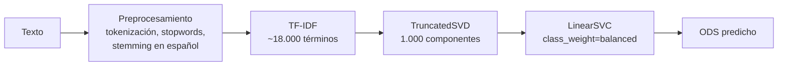

# sdg-text-classifier-tfidf-lsa

Clasificación automática de textos en español según los **Objetivos de Desarrollo Sostenible (ODS)**, con TF-IDF, modelado de tópicos con LSA (TruncatedSVD) y un clasificador lineal. Incluye un **control de fuga por textos parafraseados** y una app en Streamlit que explica qué palabras pesaron en cada predicción.

<!-- Cuando despliegues la app, agrega aquí el enlace y una captura:
[](URL-DE-TU-APP)

-->

**Stack:** Python · scikit-learn · NLTK · Streamlit

Proyecto del curso de Aprendizaje No Supervisado de la Maestría en Inteligencia Artificial (Universidad de los Andes).

---

## Resultados

| Métrica | Valor |
|---|---|
| F1 macro (validación cruzada, 5 folds) | **0,86** |
| F1 macro (test, 1.935 textos no vistos) | **0,87** |
| Accuracy (test) | 0,89 |

- **Mejores ODS:** Paz y justicia (16), Vida de ecosistemas terrestres (15) y Educación (4), con F1 de 0,94 a 0,96.
- **Punto débil:** el bloque económico. Fin de la pobreza (1), Trabajo decente (8), Industria (9) y Reducción de las desigualdades (10) se confunden entre sí, con F1 de 0,68 a 0,83.
- **Textos escritos fuera del dataset:** los 4 de prueba se clasificaron bien; el margen baja cuando el texto toca dos ODS (acceso a agua potable también se lee como salud).

---

## Cómo funciona



| Archivo | Contenido |
|---|---|
| [`MLNS-microproyecto_2_v1.ipynb`](MLNS-microproyecto_2_v1.ipynb) | Exploración, limpieza, LSA, control de fuga, modelado y evaluación |
| [`preprocesamiento.py`](preprocesamiento.py) | `preprocess_text()`: la misma limpieza para entrenar y para predecir |
| [`app.py`](app.py) | App de Streamlit |
| `modelo_ods.pkl` | Pipeline entrenado (componentes de la SVD en `float32`) |

---

## Decisiones de diseño

| Decisión | Motivo |
|---|---|
| **Eliminar 1 texto en portugués** | Se detectó el idioma de los 9.656 textos. Las stopwords y el stemmer en español no sirven para otro idioma. Las citas bibliográficas en inglés dentro de textos en español se conservaron. |
| **`preprocess_text()` como función en un módulo** | Entrenamiento y predicción deben limpiar el texto igual; además, el pipeline guardado necesita encontrar la función fuera del notebook. |
| **TF-IDF** | Da más peso a las palabras características de cada texto y menos a las que aparecen en todos los ODS (como "desarrollo"). |
| **LSA con 15 componentes para interpretar** | Permite leer los tópicos latentes y compararlos con los ODS reales. |
| **TruncatedSVD y no PCA** | PCA exige centrar los datos, lo que convierte la matriz dispersa (99,7 % de ceros) en una densa enorme. TruncatedSVD trabaja sobre la matriz dispersa. |
| **Control de fuga por parafraseo** | El dataset se tradujo con DeepL y se amplió con ChatGPT, así que hay textos que son el mismo contenido reescrito. Se buscó el vecino más cercano de cada texto con similitud coseno sobre TF-IDF (LSA no sirvió: agrupa por tema, no por contenido). Revisando pares reales se fijó el umbral en 0,65, y se formaron 66 familias con 136 textos. |
| **`StratifiedGroupKFold` para el split** | Estratifica por ODS y a la vez impide que una familia de parafraseo quede repartida entre train y test, para no inflar las métricas. |
| **GridSearchCV entre tres algoritmos** | Regresión logística, Random Forest y LinearSVC, con 150 a 1.000 componentes. Ganó LinearSVC con C = 1 y 1.000 componentes. |
| **F1 macro** | Las clases están desbalanceadas (de 312 a 1.080 textos); la accuracy se inflaría con los ODS grandes. |
| **`class_weight="balanced"`** | Evita que el modelo ignore los ODS con menos textos. |

### Explicación de cada predicción

Todo el pipeline es lineal, así que el margen de cada ODS se puede descomponer exactamente:

```
margen(ODS) = Σ  tfidf(término) × peso(término, ODS)  +  intercepto
peso = coeficientes del LinearSVC × componentes de la SVD
```

La app usa esa descomposición para mostrar qué raíces del texto empujaron la predicción hacia el ODS elegido.

---

## Ejecutar localmente

```bash
pip install -r requirements.txt
python -m streamlit run app.py
```

Las versiones de `scikit-learn` y `numpy` están fijadas en `requirements.txt` porque el modelo se guardó con ellas, y un pipeline serializado puede no cargar con otras versiones.

**Datos:** el dataset (`Datos_textosODS.xlsx`, 9.656 textos con etiquetas de ODS del 1 al 16) fue provisto por el curso y no se incluye en el repositorio. El notebook lo espera en la carpeta `data/`.

## Limitaciones y próximos pasos

- **El ODS 17 no está en los datos**, así que el modelo no puede predecirlo.
- **Una etiqueta por texto**, aunque muchos textos tocan varios ODS; un enfoque multietiqueta sería más realista.
- **TF-IDF ignora el orden y el contexto** de las palabras. Siguiente paso: comparar contra embeddings de un modelo de lenguaje multilingüe.
- **El margen no es una probabilidad.** Se podría calibrar con `CalibratedClassifierCV` para mostrar probabilidades.
